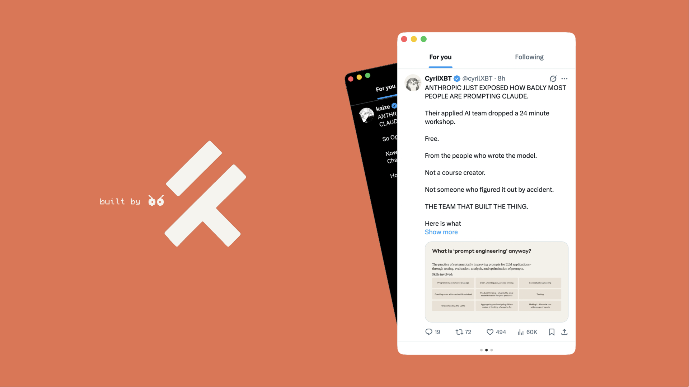

<h1 align="center">X Free</h1>
<p align="center">Your favorite 𝕏 client for macOS, now in compact mode</p>

<p align="center"></p>

---

<p align="center">
    <a href="https://swift.org"></a>&nbsp;&nbsp;
    <a href="https://github.com/dbkarashev/xfree/releases/latest"></a>&nbsp;&nbsp;
    <a href="LICENSE"></a>
</p>

## Install


Download the latest `.dmg` from the [Releases](https://github.com/dbkarashev/xfree/releases) page and drag **X Free** into your Applications folder.

X Free isn't notarized, so macOS blocks the first launch with "Apple could not verify X Free is free of malware…".

To allow it:

1. Try to open X Free once and dismiss the warning.
2. Open **System Settings → Privacy & Security**, scroll down to the **Security** section, and click **Open Anyway** for X Free.
3. Authenticate with Touch ID or your password.

After that, X Free launches normally — macOS doesn't prompt again.

### Building from source

```sh
git clone https://github.com/dbkarashev/xfree.git
cd xfree
open XFree.xcodeproj
```

In Xcode → **Signing & Capabilities**, switch the team to your own (the project ships with the maintainer's), then **Product → Run** (`⌘R`).

## Settings

<kbd>⌘</kbd> <kbd>,</kbd> opens Settings.

- **General** — appearance (light or dark, default light), hide ads on x.com.
- **Columns** — compact mode toggle, auto vs manual width, drag to reorder, swipe to delete.

Column types: `For you`, `Following`, `Notifications`, `Profile`, `Custom URL`. Custom URLs on `x.com` / `twitter.com` get the same ad-block treatment as built-in columns.

## Shortcuts

| | |
| --- | --- |
| <kbd>⌥</kbd> <kbd>/</kbd> | Toggle compact mode |
| <kbd>⌘</kbd> <kbd>R</kbd> | Refresh |
| <kbd>⌘</kbd> <kbd>+</kbd> · <kbd>⌘</kbd> <kbd>-</kbd> | Zoom in / out |
| <kbd>⌘</kbd> <kbd>1</kbd> … <kbd>⌘</kbd> <kbd>9</kbd> | Jump to column N (compact mode) |
| <kbd>⌘</kbd> <kbd>,</kbd> | Settings |

## Credits

Fork of [XDeck](https://github.com/morishin/XDeck) v2.3 by [@morishin](https://github.com/morishin). Original column layout, WebView plumbing, and ad-blocking are theirs.

This project is licensed under the [MIT License](LICENSE).
